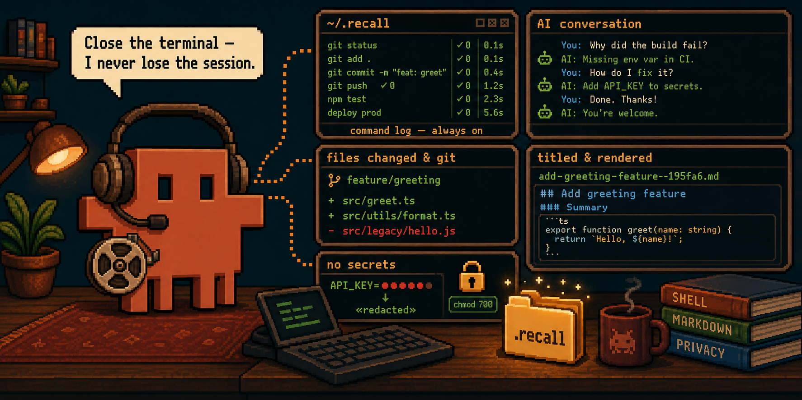
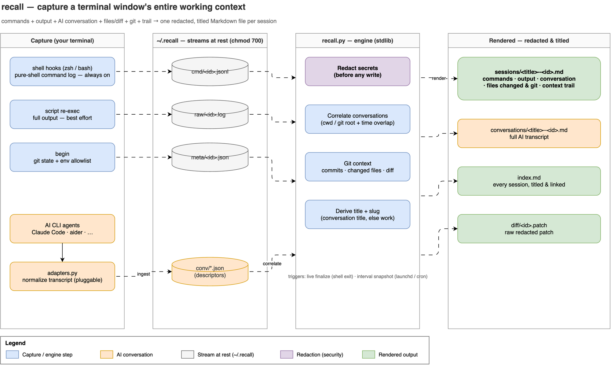

# recall

**Capture and recall a terminal window's entire working context — so a closed or crashed terminal
is never lost.**

`recall` gives every terminal window a durable memory. It records what you run — **live, per
command** (with cwd, exit code, and duration) — and, when it can, the **full output**. But a
session is more than its shell, so recall also folds in the **AI CLI conversation** you had in that
window (Claude Code, aider, … via pluggable adapters), the **files you changed** and their diff,
the **git state**, and the **directory + environment trail**. It all renders to a clean,
**secret-redacted** Markdown file, named by a meaningful **title** so the filename tells you what
the session was about. Close the terminal, reboot the laptop, or lose the window to a crash: the
context is already on disk.

> **Kit = tooling, data = yours.** This repo contains *no captured data*. Everything recall
> records lives under `~/.recall` (chmod 700), is secret-redacted before write, and is never
> committed.



## The entire context, not just the shell

Recalling a window gives you the whole picture — not just the commands (see
[`reference/context.md`](skills/recall/reference/context.md)):

- **Conversation.** The AI CLI agent transcript from that window — Claude Code, aider, and others
  via **pluggable adapters** (`RECALL_AGENTS`). Each agent's native store is normalized to one
  shape, rendered to a redacted transcript, and **correlated** to the terminal session by working
  directory (or git root) and overlapping time.
- **Files changed & git.** Repo, branch, commits made during the session, a per-file
  added/removed table, and a capped, redacted diff.
- **Context trail.** Every directory visited plus a small allow-listed snapshot of the environment
  at session start.
- **Titled files.** Named from the correlated conversation's title (or the repo + distinctive
  commands), so `add-greeting-feature-to-proj--195fa6.md` beats an opaque id. The terminal id and
  title are stored in metadata and shown in the session header.

## Works all the time

Capture is layered so you always get *something*:

- **Command log — always on.** zsh `preexec`/`precmd` hooks (and the bash `DEBUG` trap +
  `PROMPT_COMMAND`) append each command to a JSONL stream the instant it finishes. Pure POSIX
  shell on the hot path — no interpreter spawn, no prompt latency.
- **Output transcript — best effort.** recall transparently re-execs your shell under `script`
  once per window. If that can't start (no `script`, no TTY, `RECALL_NO_SCRIPT`, CI), it
  **degrades to a complete commands-only log** instead of failing.

## Two triggers: live + interval

1. **Live, per command** — logged the moment each command finishes; the session is rendered on
   shell exit.
2. **Interval snapshot** — a launchd LaunchAgent (macOS) or crontab line (Linux) runs
   `recall snapshot` every N seconds (default 300), re-rendering **all** sessions so a
   force-closed window is still captured up to the last tick.

## Cross-platform

| | macOS | Linux |
|---|---|---|
| Shells | zsh, bash | zsh, bash |
| Output capture | `script -q <file> <cmd>` (BSD) | `script -q -f -c <cmd> <file>` (util-linux) |
| Scheduler | launchd LaunchAgent (`StartInterval`) | crontab (`*/M * * * *`) |

## Privacy is not optional

- **Redaction before write.** Every command and every output line runs through
  `assets/redaction-patterns.txt` (AWS keys, `KEY=value` secrets, `export SECRET=…`, Bearer/
  Authorization headers, JWTs, `ghp_`/`xoxb-`/`sk-` tokens, PEM headers) → `«redacted»`.
- **Private store.** `~/.recall` is created `chmod 700`.
- **Never committed.** `scan_secrets.sh` (CI) fails if any captured artifact is tracked or a
  credential-shaped value appears in a tracked file. See
  [`reference/privacy.md`](skills/recall/reference/privacy.md).

## Commands

| Command | Does |
|---|---|
| `/recall:setup` | Print (or `--apply`) the shell-integration + scheduler install steps |
| `/recall:list` | List captured sessions, newest first |
| `/recall:show` | Render + print a session (`last`, an id, or this window's prior session) |
| `/recall:search` | Grep all rendered sessions for a term |
| `/recall:resume` | Reprint the last/this-window session's dir + recent commands to pick up where you left off |
| `/recall:snapshot` | Re-render every session now (what the interval scheduler runs) |
| `/recall:ingest` | Import AI CLI conversations (Claude Code, aider, …) so sessions carry their full context |

## Install

```
/plugin marketplace add pur4v/recall
/plugin install recall
```

Then enable capture:

```sh
# print the steps (dry run), or --apply to append the source line + install the scheduler
python3 skills/recall/scripts/recall.py setup --apply --interval 300
sh skills/recall/scripts/install-scheduler.sh --interval 300
```

Open a new terminal — capture starts automatically.

## How it fits together

- `scripts/recall.{zsh,bash}` — the shell integrations (guards → session env → `script` re-exec →
  hooks).
- `scripts/recall.sh` — fast dispatcher; the per-command `log` is pure shell.
- `scripts/recall.py` — render + query + ingest engine (stdlib only): render / ingest / snapshot /
  list / show / search / resume / redact / setup.
- `scripts/adapters.py` — pluggable AI-agent conversation adapters (Claude Code, aider, …).
- `scripts/install-scheduler.sh` — launchd / cron installer.
- `scripts/scan_secrets.sh` — CI guard.

See [`skills/recall/SKILL.md`](skills/recall/SKILL.md) and the reference docs
([architecture](skills/recall/reference/architecture.md),
[capture](skills/recall/reference/capture.md),
[context](skills/recall/reference/context.md),
[privacy](skills/recall/reference/privacy.md),
[scheduler](skills/recall/reference/scheduler.md)).

## Example

[`examples/demo-session/`](examples/demo-session/) is a fictional rendered session + index —
what recall writes into `~/.recall`, with redaction and progress-redraw collapsing shown.

## License

MIT © 2026 pur4v.
